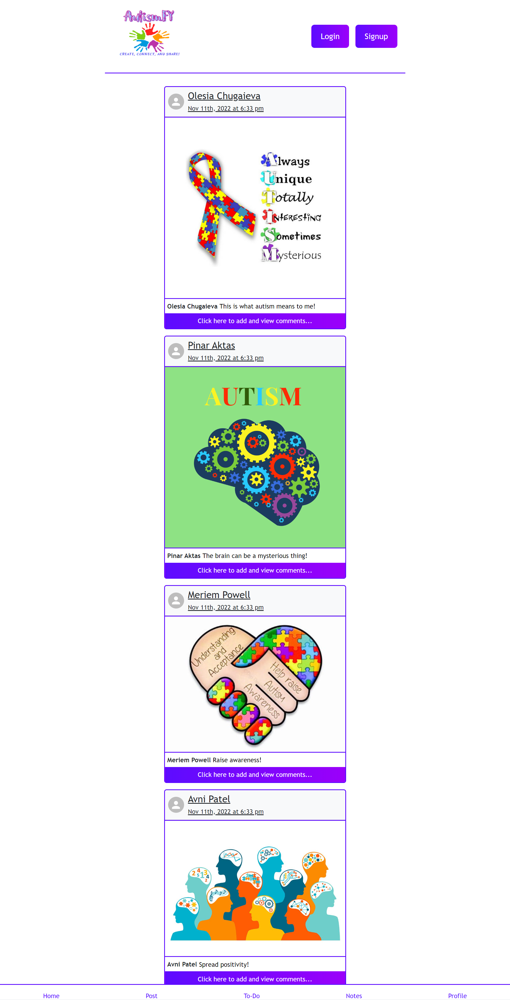

# 👩‍💻Team Nova Twisters 👩‍💻

---

## 🏫 AutismFY: Routines, Boards & Connections

This application is designed to help parents and caregivers of younger Autistic children create routine To-Do Lists, log important information in a Notes tab, share and connect with other parents and caregivers by creating posts. In this project we will build and design this app using the React, create our own server-side API, add user authentication, and connect to a database.

## ✍️User Story:

```
As a Parent I want to be able to open and navigate a webpage
The webpage provides a login window
Once I provide my credentials, I am logged into my portal
In my portal I can see my profile with my posts, or a newsfeed with my friends posts
I am able to click on To-Do tab and enter a list of tasks or routines
I am able to delete or update a routine item
In my portal I am also able to see Notes tab and enter a note
I am able to delete or drag the note anywhere on the page and it will persist
```

## 📑Acceptance Creteria:

```
Given a webpage functions properly
When I type my username/email and password OR sign-up
Then I can log into my portal
When I am in my boards portal
Then I am presented with a footer of tabs
When I click on a tab it takes me to its respective page
Then I am able to add a To-Do routine/list, a Note, or view my profile with my posts or create a post
When I click To-Do tab,
Then I can enter a list item
Then I can see my item presisted and is saved to my profile, I can also delete it or update it
When I click on Notes tab
Then I am able to enter a note
Then I am able to drag the note anywhere on the page, and click X to delete it
When I want to create a post
Then I can click on Post tab
Then I can create a post by adding a text and an image URL for image to upload to my profile newsfeed
When I want to view all my posts
Then I click on Profile tab to see all my posts and be able to delete a post
When I want to view the newsfeed of all posts from friends and myself
Then I click on Home tab
When I want to log out
Then I click on Logout button and I am not able to see my profile, notes, or to-do
```

## 📹Website Demo:



### 💻Link to Deployed Heroku App:

- https://hidden-beach-19071.herokuapp.com/

### 📂Link to the Repo:

- https://github.com/avni0000patel/AutismFY

### ✒️Authors:

- Avni Patel
- Meriem Powell
- Olesia Chugaieva
- Pinar Aktas
